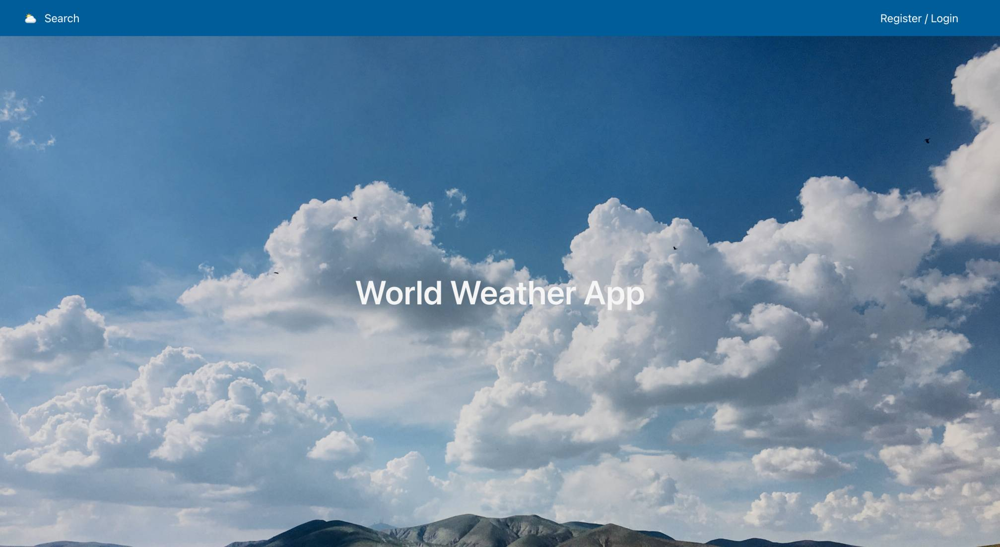

# World Weather App
Software Engineering Immersive Course || Project-2 || Group Project - 2 Members || 2 days

## Overview

A weather app that consumes the OpenWeather API to display real-time weather information for cities across the globe.
 
<p align="center" >
 
</p>
 
[World Weather App - Deployed App](https://bit.ly/world-weather-app-rk)

## Installation

- Clone the repo
- Visit https://openweathermap.org/ and register.
- Go to 'API keys' tab in profile and generate key.
- Create a ```.env``` file and enter
  ```
  ESLINT_NO_DEV_ERRORS=true
  REACT_APP_API_ACCESS_TOKEN='your unique key from API keys tab as a string'
  ```
- Install all frontend packages (from package.json) by running ```yarn```
- Start server with ```yarn start```
 
 
## Table of Contents
[The Brief](#the-brief) <br>
[The Build](#the-build) <br>
[Wins](#wins) <br>
[Challenges](#challenges) <br>
[Bugs](#bugs) <br>
[Future Improvements](#future-improvements) <br>
[Key Learnings](#key-learnings) <br>

 
 
## The Brief
 
Using React, design an app that consumes a public API.


<br>
 
## The Build

After being paired our first task was to select a public API. I wanted to ensure the API we used had enough information to be interesting and could be visual. After testing a number of APIs we settled on Open Weather.

After this we created a wireframe as a guideline on how our app would look and flow.


<br>
 

## Wins


## Challenges


## Bugs


## Future Improvements


## Key Learnings

