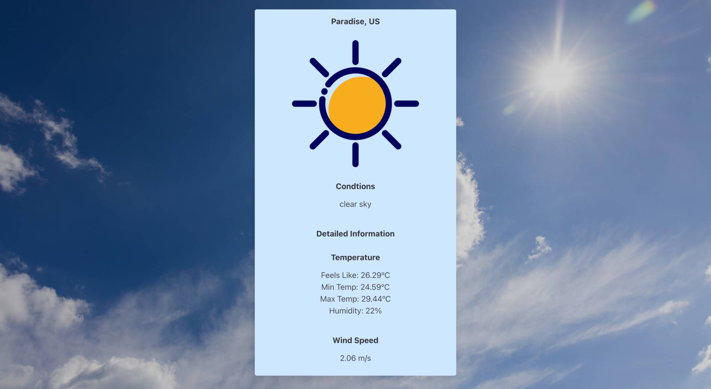
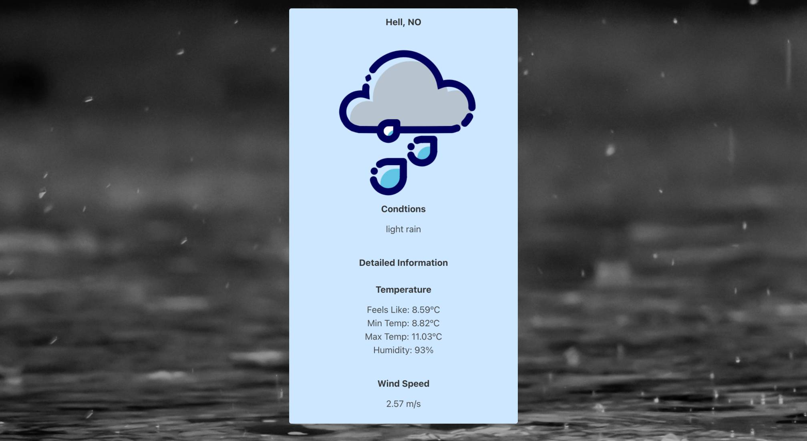

# World Weather App
Software Engineering Immersive Course || Project-2 || Group Project - 2 Members || 2 days

## Overview

A weather app that consumes the OpenWeather API to display real-time weather information for cities across the globe.
 
<p align="center" >
 
</p>
 
[World Weather App - Deployed App](https://bit.ly/world-weather-app-rk)

## Installation

- Clone the repo
- Visit https://openweathermap.org/ and register.
- Go to 'API keys' tab in profile and generate key.
- Create a ```.env``` file and enter
  ```css
  ESLINT_NO_DEV_ERRORS=true
  REACT_APP_API_ACCESS_TOKEN='your-unique-key-from-API-keys-tab-as-a-string'
  ```
- Install all frontend packages (from package.json) by running ```yarn```
- Start server with ```yarn start```
 
 
## Table of Contents
[The Brief](#the-brief) <br>
[The Build](#the-build) <br>
[Wins](#wins) <br>
[Challenges](#challenges) <br>
[Bugs](#bugs) <br>
[Future Improvements](#future-improvements) <br>
[Key Learnings](#key-learnings) <br>

 
 
## The Brief
 
Using React, design an app that consumes a public API in a hackaton style 2 day window.


<br>
 
## The Build

After being paired our first task was to select a public API. I wanted to ensure the API we used had enough information to be interesting and could be visual. After testing a number of APIs we settled on Open Weather.

After this we created a wireframe as a guideline on how our app would look and flow.

The remainder of the project was largely pair-coded using VSCode's Live Share functionality with one person taking the lead.

Our initial approach was to test our ```get``` request and make sure we could access the information as expected.

An early challenge here was the path for the get request. Until this point we had been working with unique IDs, but Open Weather understandably required a city name - and these aren't unique.

In order to get information displayed in the app we decided to use the ```[0]``` index of the array returned. 

When we had this in place we could then map through the array to display multiple results and access the unique city ID to use as a 'detailed display'.

We added a pseudo 'Register/Login' feature that stored a username to local storage that allowed access to a 'favourites' page however some of the delays we ran into during the project meant we were unable to implement functionality to this component.

<br>
 

## Wins

At the time I was proud of the background image changing based on the type of weather. I later opened this up to the weather icons that display on the cards for each city.

```js

<section className={`section hero is-fullheight-with-navbar ${filteredCity[0].weather[0].main}`}>

```

CSS
```css

.Clear {
  background: linear-gradient( rgba(0, 0, 0, 0.2), rgba(0, 0, 0, 0.1)), url(../assets/Clear.jpg);
  background-size: cover;
}

```

<p align="center" >
 
</p>

<p align="center" >
 
</p>

With experience since I have come to realise this could be improved by not having individual classes for each weather type in CSS and instead apply the style directly to the element in the component.

I was also pleased with being able to utilise ```params``` to access multiple pieces of information from the paths, having only used one before.

As a first project accessing an API I really enjoyed the logical steps to access the information and display it. 

It was great to work with another person and experience pair-coding. It improved my communication skills as I had to learn how to explain my thought process to another person. It also taught me to relinquish control and share responsibility.

## Challenges

Time was again a factor in this project. I had lots of ideas that I wanted to incorporate that we simply did not have time for.

A major delay in the project was the time taken to complete the request to the API before setting the data to state. The components were regularly trying to render before the data was available and would throw errors. This was the largest factor in not getting to add some of the further details. 


## Bugs

- There is no list of 'weather types' on the Open Weather site so these may not always be accounted for in the icons displayed on cards. Since revisiting this I have discovered a 'fog' and 'mist'. The icon set I used for the cards do not have an equivalent to these so they both reuse the 'Clouds' icon.
- The background images do not all have equivalents. In the event they do not, the background image is the same as the home/search screen.
- For cities in the US Open Weather does not have further information on state, therefore if there are multiples of a city name in the US there is no way to differentiate these.
- The times on each city card are shown in the local time for the machine accessing the app regardless of the city's location. 


## Future Improvements

- I would refactor the background image code to be applied directly to the element instead of multiple classes.
- As this was my first React app I was unaware of the possibility of passing state through the location to different components. I was only aware of the potential to pass props from a parent to a child. I would refactor the ```WeatherDetail``` component to remove the redundant get request and pass the data as state.
- The initial plan was for the detailed page to display a 5 day weather forecast. I could have very quickly accessed the data to add here, however, I would not have been happy with the limited styling I would be able to apply in the remaining time and it would have been very much incomplete.
- Implement a means of translating lat and long into states for US cities as well as returning the time relative to the city.


## Key Learnings

This project was key in learning to work with other people in a fast paced coding environment. I learned to accept the pressure of someone watching me code. I also found a way to utilise some experience from previous non-technical roles. My partner was 2 time zones ahead of me and I would therefore work on when they finished for the day. I would leave them a message detailing what I had implemented while they were offline and on occasion leave comments in the code to explain my rationale in case they were back online before me.


